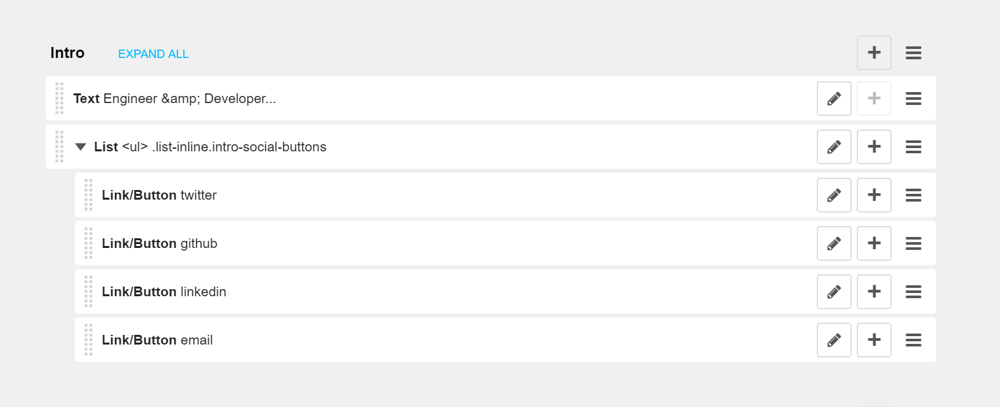

# Django CMS Listyle

Adds a plugin to embed an ordered or unordered list to Django CMS. Children are automatically wrapped in `<li>` tags.

The plugin extends the [Django CMS Style](https://github.com/divio/djangocms-style) plugin in order to make the same configurations available (index, classes, etc..)


## Quick Start

1. Install the easy way, using pip:

        $ pip install djangocms-listyle

2. Add "cmsplugin_listyle" to your INSTALLED_APPS setting like this:

        INSTALLED_APPS = [
            ...
            'djangocms_listyle',
        ]

3. Run `python manage.py migrate` to create the plugin models.


## Usage

Let say you want to build a set of social buttons like in the following example, which requires rendering an unordered list of elements:



The HTML being for the button row being:

	<ul class="list-inline intro-social-buttons">
      <li>
        <a href="#" class="btn btn-default btn-lg network-name" role="button">
          
          twitter
        </a>
      </li>
      <li>
        <a href="#" class="btn btn-default btn-lg network-name" role="button">
          
          github
        </a>
      </li>
      <li>
        <a href="#" class="btn btn-default btn-lg network-name" role="button">
          
          linkedin
        </a>
      </li>
      <li>
        <a href="#" class="btn btn-default btn-lg network-name" role="button">
          
          email
        </a>
      </li>
	</ul>

Using the Django CMS Listyle plugin, we can easily nest any listed objects.



What a time to be alive.


## License

This project is licensed under GPL 3.0 - see [LICENSE](LICENSE.md) for details.
